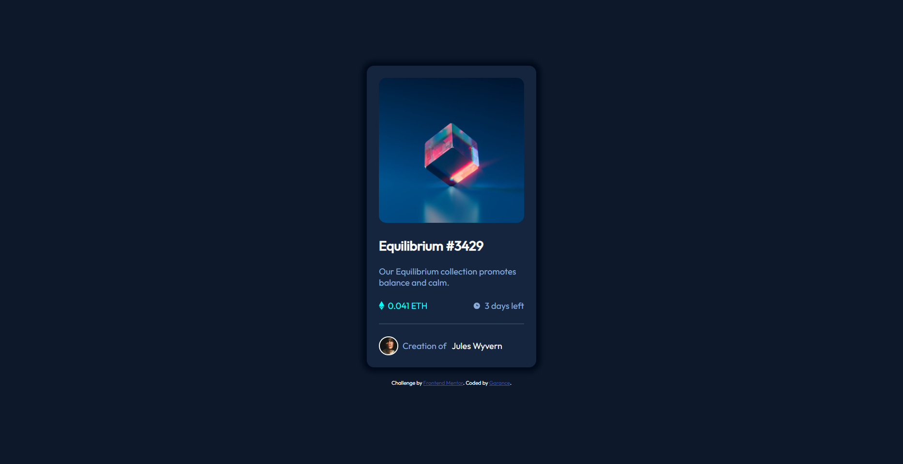
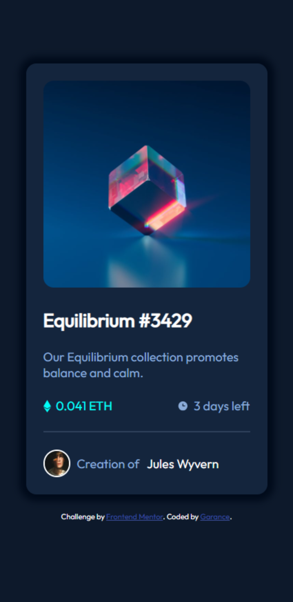

# Frontend Mentor - NFT preview card component solution

This is a solution to the
[NFT preview card component challenge on Frontend Mentor](https://www.frontendmentor.io/challenges/nft-preview-card-component-SbdUL_w0U).
Frontend Mentor challenges help you improve your coding skills by building realistic projects.

## Table of contents

- [Screenshot](#screenshot)
- [Links](#links)
- [Built with](#built-with)
- [Author](#author)

### Screenshot

 

### Links

- Solution URL: [Frontend Mentor Solutioo](https://www.frontendmentor.io/solutions/nft-card-component-htmlcss-pTD8fCdUJl)
- Live Site URL: [Github Live](https://dgarance.github.io/nft-card-component/)

## My process

### Built with

- Semantic HTML5 markup
- CSS custom properties
- Flexbox
- Mobile-first workflow

## Author

- Frontend Mentor - [@DGarance](https://www.frontendmentor.io/profile/DGarance)
- Github- [@DGarance](https://github.com/DGarance)
